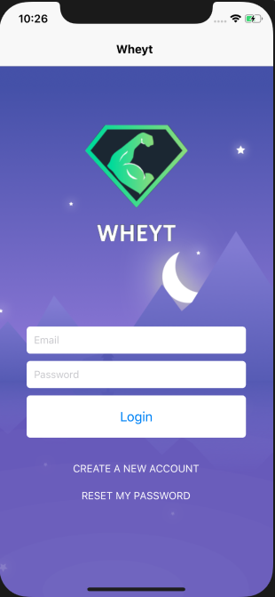
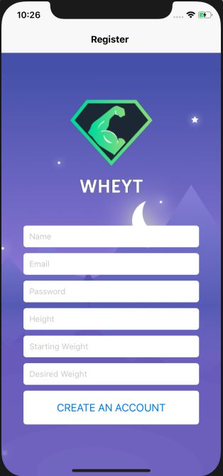

**App Summary and Purpose**

Wheyt was developed through the use of the React Native mobile application framework, as a four-week personal project. The aim of the project was to learn the React Native mobile-application framework, in an attempt to acquire the skills which could be later applied to create more complex applications instead. 

The application is a management tool primarily aimed towards individuals that are actively trying to lose weight. It provides them with the tools they need to better manage themselves in order to achieve their goals. Wheyt allows it’s users to track the foods they have eaten through the meal and calorie tracking capabilities. Registered individuals are also provided with access to a limited selection of relevant health- related articles, in hopes that the gained knowledge will assist, supplement or boost their weight-loss. Additionally, users are able to maintain a historical record of their weight-loss in order to monitor how closely they are meeting their overall goals. This historical weight-loss record is then analysed through a number of different metrics, allowing the app to provide users with personalised, custom feedback on their current progress.

**External Components**

**Google News API**

Google News API is a widely adopted news collection agency that aims to provide developers with access to news information metadata – collected from thousands of different sources globally – in real-time. The service provides multilingual support, delivering news data in a large multitude of languages. News API can be conveniently accessed and searched through the use of HTTP REST requests through the use of any web or mobile platform. In response, a JSON object is returned for any query that is processed through the service. Wheyt primarily uses the Google News API in order to acquire metadata about, and incorporate the twenty most recent fitness related articles within the Home screen of the application. The API was included in hopes of providing valuable, supplementary weight-loss knowledge that could potentially aid users throughout their weight-loss journey, one of Wheyt’s many business objectives.

**Firebase and Firestore**

Google Firebase provides a supporting backend development platform which aids developers developing applications for Android, iOS and the Web. Firebase provides numerous core development utilities and services which have been extensively utilised over the course of this project.

**Application Screenshots**

The images provided (below) showcases my application’s login and registration pages. The pages are tasked with the responsibility of retrieving, validating and processing user login information. Should real time input validation fail to pass on any of the inputs provided to the user the input field is underlined in red, with a corrective message being presented to the user in order to resolve the issue. 

